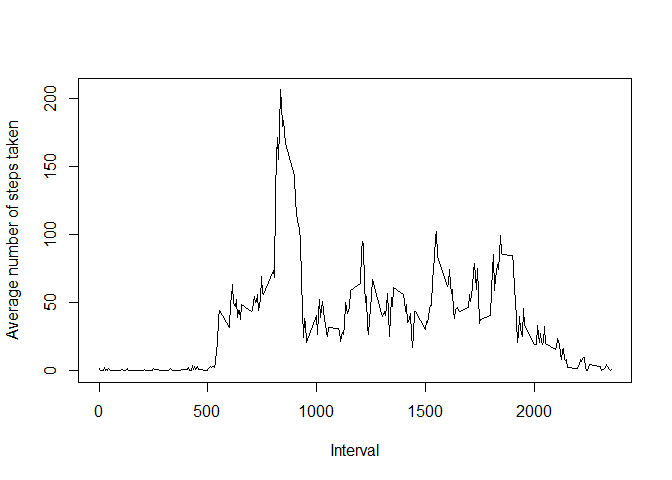

## Loading and preprocessing the data
1. Load CSV file

```r
raw_data <- read.csv("activity.csv")
```

## What is mean total number of steps taken per day?
1. Calculate the total number of steps taken per day

```r
sum_steps_by_day <- aggregate(steps~date,data=raw_data,FUN=sum)
```

2. Histogram of the total number of steps taken each day

```r
hist(sum_steps_by_day$steps,xlab="steps")
```

<!-- -->

3. Mean of the total number of steps taken per day

```r
mean(sum_steps_by_day$steps)
```

```
## [1] 10766.19
```

4. Median of the total number of steps taken per day

```r
median(sum_steps_by_day$steps)
```

```
## [1] 10765
```

## What is the average daily activity pattern?
1. Make a time series plot (i.e. type = "l") of the 5-minute interval (x-axis) and the average number of steps taken, averaged across all days (y-axis)

```r
mean_steps_by_interval <- aggregate(steps~interval,data=raw_data,FUN=mean)
plot(mean_steps_by_interval$interval,mean_steps_by_interval$steps,xlab="Interval",ylab="Average number of steps taken",type = "l")
```

<!-- -->

2. The interval 835 is on average across all the days in the dataset and contains the maximum number of steps

```r
mean_steps_by_interval[which.max(mean_steps_by_interval$steps),]$interval
```

```
## [1] 835
```
## Imputing missing values
1. The total number of missing values in the dataset

```r
sum(is.na(raw_data$steps))
```

```
## [1] 2304
```

2. Filling in all of the missing values in the dataset.And Create a new dataset that is equal to the original dataset but with the missing data filled in 

```r
new_data <- raw_data
median_steps_by_day <- aggregate(steps~date,data=new_data,FUN=median)
na_rownames<-as.numeric(rownames(new_data[is.na(new_data$steps),]))
for (i in 1:length(na_rownames)){
    date <- new_data[na_rownames[i],]$date
    if (nrow(median_steps_by_day[which(median_steps_by_day$date == date),]) == 0) {
        new_data[na_rownames[i],]$steps <- 0
    }
    else {
        new_data[na_rownames[i],]$steps <- 
            median_steps_by_day[which(median_steps_by_day$date == date),]$steps
    }
}
sum(is.na(new_data$steps))
```

```
## [1] 0
```
3. Make a histogram of the total number of steps taken each day and Calculate 

```r
new_sum_steps_by_day <- aggregate(steps~date,data=new_data,FUN=sum)
hist(new_sum_steps_by_day$steps,xlab="steps")
```

<!-- -->

4. the mean total number of steps taken per day

```r
mean(new_sum_steps_by_day$steps)
```

```
## [1] 9354.23
```

5. the median total number of steps taken per day

```r
median(new_sum_steps_by_day$steps)
```

```
## [1] 10395
```
## Are there differences in activity patterns between weekdays and weekends?
1. Create a new factor variable in the dataset with two levels - "weekday" and "weekend" indicating whether a given date is a weekday or weekend day.

```r
library("lattice")
Sys.setlocale("LC_ALL","English")
```

```
## [1] "LC_COLLATE=English_United States.1252;LC_CTYPE=English_United States.1252;LC_MONETARY=English_United States.1252;LC_NUMERIC=C;LC_TIME=English_United States.1252"
```

```r
new_data$week <- ifelse(weekdays(as.Date(new_data$date)) %in% c("Saturday","Sunday"), "weekend", "weekday")
```

2. Make a panel plot containing a time series plot (i.e. type = "l") of the 5-minute interval (x-axis) and the average number of steps taken, averaged across all weekday days or weekend days (y-axis). See the README file in the GitHub repository to see an example of what this plot should look like using simulated data.

```r
mean_week <-aggregate(steps~interval+week,new_data,mean)

xyplot(steps ~ interval | week, data = mean_week, 
        type = "l", layout = c(1, 2))
```

<!-- -->
